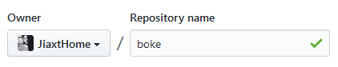
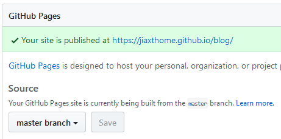
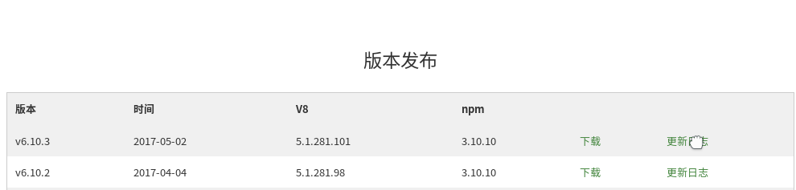
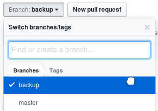
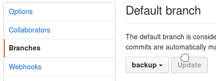

# 配置github端

## 准备
github配置前提：

1. 已申请github账号
2. 本机已安装git
3. 本机ssh key已配置到github

以上操作，不明白的可自行网上搜索

## 创建github Pages
（1）新建一个repository库（名称随便写，没必要一定是xxx.github.io）

（2）配置github pages
在settings面板中选择将"master"分支作为github pages站点

---

# 配置hexo端
## 安装Node.js和npm
Node.js是hexo的运行环境，npm是Node.js的包管理器，这两个是hexo运行的必要工具，可去[中文官网](http://nodejs.cn/) 下载最新版本

解压tar.xz格式并移动到/usr/local/node

	$ xz -d node-v6.10.3-linux-x64.tar.xz
	$ tar -xvf node-v6.10.3-linux-x64.tar
	$ sudo mv node-v6.10.3-linux-x64 /usr/local/node
	
配置环境变量

	$ sudo gedit /etc/profile
	
在最后添加如下一行

	export PATH=/usr/local/node/bin:$PATH
	

## 安装hexo
hexo命令行安装即可，详细介绍可以查询[hexo官网](https://hexo.io/)

	$ sudo npm install -g hexo-cli

进入新建文件夹，初始化hexo

	$ cd blog
	$ hexo init //初始化hexo到当前目录
	$ hexo g //生成静态网页
	$ hexo s //启动本地服务器

此时，在浏览器输入http://localhost:4000就可以浏览效果了。

---

# 联调与发布
下面我们需要将本地静态网页发布到github上。
首先，配置blog目录下的站点配置文件_config.yml
	
	deploy:
  		type: git
  		repository: git@github.com:JiaxtHome/blog.git
  		branch: master
	# URL
		## If your site is put in a subdirectory, set url as 'http://yoursite.com/child' and root as '/child/'
		url: https://jiaxthome.github.io/blog/
		root: /blog
	
注：URL需要配置，否则下面更换主题无法生效，其他选项可根据需求以后再慢慢配置

然后，安装自动发布模块

	$ npm install hexo-deployer-git --save
	
发布到github

	$ hexo clean //清除缓存
	$ hexo g //生成静态网页
	$ hexo d //发布到github
	
此时在浏览器中输入https://jiaxthome.github.io/blog/ 就可以看到真正的在线效果了。
博文发布命令

	$ hexo n "title"
	
此时，会在source/_posts目录下会生成title.md文件，当然也可以直接复制.md文件到该目录下。

---

# 更换主题
以Next主题为例，首先下载主题

	$ cd your-hexo-site
	$ git clone https://github.com/iissnan/hexo-theme-next themes/next
	
然后修改站点配置文件_config.yml

	theme: next
	
此时重新发布后就可以看到next主题效果了。
各个主题为了满足个性化，都有自己的主题配置文件，文件名也是_config.yml，位于主题自己的目录下，如果需要可以参考各主题的官网文档配置。本主题可以参考[Next主题官网](http://theme-next.iissnan.com/)。

---

# 图片存储
关于MarkDown文件引用图片的问题可以使用"图床"解决，但存在不安全因素。这里介绍hexo提供的方案：
首先，修改站点配置文件_config.yml

	post_asset_folder: true
	
然后，安装 CodeFalling/hexo-asset-image插件

	$ npm install https://github.com/CodeFalling/hexo-asset-image --save
	
此时通过 hexo n "title" 命令生成博文的同时，会创建一个同名的文件夹，以后我们引用的图片资源就可以放在这里了。当然，如果是拷贝的.md文件，手动创建一个同名文件夹就可以。
在.md文件中按照如下方式引用

	
	
这样，我们的图片资源就随着静态网页一起发布到github上了。

---

# 备份与恢复
个人博客将所有.md博文和资源都放在本地，这就有两个最大的弊端：

- 一旦本地文件丢失，后果不堪设想
- 无法在多台电脑同步发布博文

我们的思路是：
>将本地博文和资源也上传到github保存，在需要同步工作的多个电脑上都安装hexo环境，这样就可以用git做同步管理。

首先，在github的博客仓库新建一个分支backup
 
并设置为默认分支

注：由于这样新建的backup分支会包含master分支内容，建议先删除再按照“配置github端”重建空仓库。

本地新建.gitignore文件

	/.deploy_git
	/public
	db.json

本地初始化仓库

	$ git init
	$ git remote add origin git@github.com:JiaxtHome/blog.git

上传本地资源
	
	$ git add .
	$ git commit -m "init"
	$ git push origin backup
	
此时数据已备份完毕，如果需要在新电脑工作，只需要在新电脑初始化仓库后，执行

	$ git fetch --all
	$ git checkout -b backup remotes/origin/backup

即可将数据恢复，如果hexo环境已安装，就可以直接生成和发布了。
以后，每次在不同电脑操作前先执行git pull；发布完毕后，再push到远程即可。

